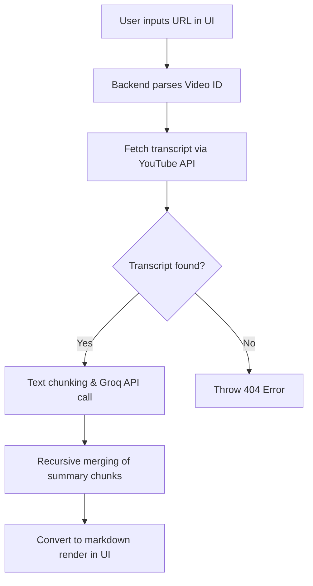

# 🎥 YouTube AI Summarizer

An automated, AI-powered pipeline and web application designed to fetch, summarize, and deliver YouTube video summaries. Simply paste a YouTube URL, select a summary style, and instantly receive structured markdown summaries in the browser or delivered directly to your email.

---

## ⚡ Key Features

*   **Transcription Extraction**: Automatically fetches captions from YouTube videos, handling edge cases where transcripts are disabled or unavailable.
*   **Intelligent Text Chunking**: Automatically slices transcripts of long videos to fit within the AI model's context window.
*   **Multi-Pass Synthesis**: Summarizes chunks individually and recursively merges them, preserving key metrics, technical terms, and overall context.
*   **Diverse Styles**: Support for multiple tailorable formats:
    *   `Bullet Points`: Clean, category-grouped key takeaways with bold concept headers.
    *   `Executive Brief`: Concise 3–5 sentence professional TL;DR briefs.
    *   `Student Notes`: Detailed study guide formatting (Executive summary, Terminology index, Chronological flow).
    *   `Narrative Recap`: Conversational, story-based summaries.
    *   `Action Items`: Practical lists highlighting concrete steps and recommendations.
*   **Interactive UI**: A sleek, monochrome wizard interface built using React and Vite.
*   **Email Delivery**: Delivers formatted summaries in HTML emails using the Resend API.

---

## 🛠️ Tech Stack

*   **Frontend**: React (Vite), Vanilla CSS (Monochrome Design System)
*   **Backend**: FastAPI (Python), Uvicorn, Pydantic
*   **AI Engine**: Groq SDK (running `Llama-3.3-70b-versatile` by default)
*   **Emailing**: Resend SDK
*   **Data Scraper**: `youtube-transcript-api`

---

## 📂 Project Structure

```text
youtube-video-summarizer/
  ├── backend/               # FastAPI application
  │   ├── app/
  │   │   ├── core/          # Styles and prompt configurations
  │   │   ├── routes/        # API route handlers (/summarize, /email/send)
  │   │   ├── schemas/       # Pydantic request models
  │   │   ├── services/      # Core logic (summarizer, extractor, emailer)
  │   │   └── main.py        # Backend server entrypoint
  │   └── requirements.txt   # Python dependencies
  │
  ├── frontend/              # React application
  │   ├── src/
  │   │   ├── api/           # API fetch wrappers
  │   │   ├── components/    # Screen views (Home, StyleSelector, ResultScreen)
  │   │   ├── App.jsx        # Main component & state manager
  │   │   └── styles.css     # UI Styling system
  │   └── package.json       # Node package manager configurations
  │
  ├── data/                  # Local storage folder for cached summaries
  ├── docs/                  # Reference documents & guides
  ├── scripts/               # Standalone testing scripts
  └── main.py                # Central CLI launcher script
```

---

## 🚀 Getting Started

### 1. Prerequisites
Ensure you have the following installed on your machine:
*   Python 3.10+
*   Node.js (v18+) and npm
*   A Groq API key and a Resend API key

### 2. Environment Setup
Create a `.env` file in the root folder of the project with the following configuration:

```env
YOUTUBE_API_KEY=your_youtube_api_key
GROQ_API_KEY=your_groq_api_key
RESEND_API_KEY=your_resend_api_key
GROQ_MODEL=llama-3.3-70b-versatile
```

### 3. Backend Setup
Activate the virtual environment and install Python packages:

```powershell
# Activate virtual environment (Windows)
& 'venv/Scripts/Activate.ps1'

# Install dependencies
pip install -r backend/requirements.txt
```

Launch the backend server:
```powershell
python -m uvicorn backend.app.main:app --reload
```
The API documentation will be available at `http://127.0.0.1:8000/docs`.

### 4. Frontend Setup
Open a separate terminal window, navigate to the frontend directory, install dependencies, and run the development server:

```powershell
cd frontend
npm install
npm run dev
```
Open your browser and navigate to `http://localhost:5173`.

### 5. Running the Central CLI Launcher
If you prefer a CLI interface, you can run the central python launcher to select script tasks:
```powershell
python main.py
```

---

## 📘 Workflows & API Endpoints

### 🔄 Summary Generation Flow


### 🔌 Primary Backend Endpoints
*   `POST /summarize`
    *   **Body**: `{ "url": "string", "style": "string" }`
    *   **Returns**: `{ "video_id": "string", "title": "string", "summary": "string", "style": "string" }`
*   `POST /email/send`
    *   **Body**: `{ "video_id": "string", "title": "string", "summary": "string", "style": "string", "email": "string" }`
    *   **Returns**: `{ "success": true }`

---

## ⚠️ Troubleshooting & Rate Limits

*   **YouTube Transcript Errors**: If you encounter errors saying transcripts are disabled, consult [docs/IP_WORKAROUNDS.md](file:///c:/Users/Asus/Desktop/YouTube_Video_%20Summarizer/docs/IP_WORKAROUNDS.md). YouTube often blocks requests from cloud providers or residential connection pools due to rate limiting.
*   **Encoding Issues on Windows**: If you run console scripts and get a `UnicodeEncodeError`, ensure your terminal supports UTF-8. The scripts are configured to reconfigure stdout to UTF-8 dynamically.
