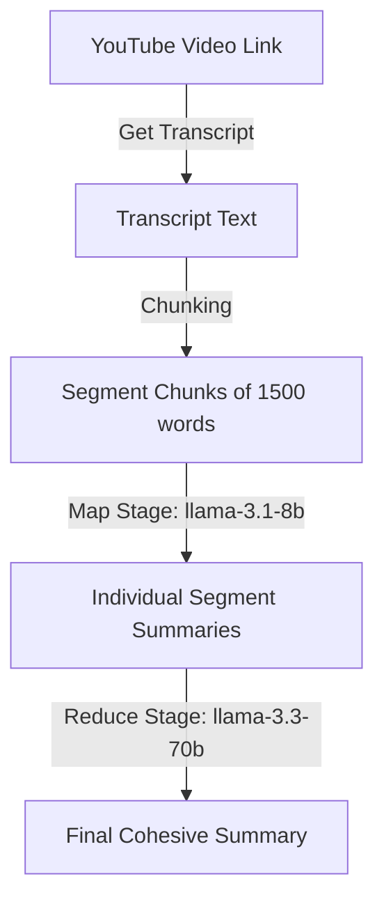

# 🧠 Core AI & Summarizer Pipeline

This document explains the technical implementation of Recap's summarization pipeline, focusing on how we parse massive transcripts and stay within API rate limit constraints.

---

## 🛠️ The Map-Reduce Pipeline Flow

When you request a summary of a video, the server performs a **Map-Reduce** workflow:

1. **Extraction:** The backend extracts the video ID from the URL and fetches the raw transcript (captions) using `youtube-transcript-api`.
2. **Chunking (Split):** Very long videos contain more text than the model can digest in a single response. We split the transcript into segments of **1,500 words** each (using [transcript_fetcher.py](file:///c:/Users/Asus/Desktop/YouTube_Video_%20Summarizer/backend/app/services/transcript_fetcher.py#L46)). This standard size ensures each chunk request stays below 4,000 tokens, safely within the strict **6,000 TPM limit** of Groq's free-tier `llama-3.1-8b-instant` map model.
3. **Map Stage (Parallel Summarization):** We summarize each 1,500-word segment individually to extract its core facts.
4. **Reduce Stage (Consolidation):** We combine all segment summaries into a single, structured, final output matching the selected style template.

---

## ⚡ Hybrid Model Strategy (8B / 70B Routing)

On the Groq free tier, different models have different rate limits. The premium **Llama-3.3-70b** model is limited to only **100,000 tokens per day (TPD)**, which is easily exhausted by a single long video.

To solve this, Recap uses a **Dual-Model Hybrid Pipeline** inside [summarizer.py](file:///c:/Users/Asus/Desktop/YouTube_Video_%20Summarizer/backend/app/services/summarizer.py):

* **Map Stage (llama-3.1-8b-instant):**
  * Individual segment summaries are processed using the fast 8B model.
  * **Why:** On Groq, the 8B model has a massive quota (1,000,000+ tokens/day). It runs instantly, doesn't trigger limits, and consumes zero tokens of your premium daily limit.
* **Reduce Stage (llama-3.3-70b-versatile):**
  * The final combine step is processed using the powerful 70B model.
  * **Why:** The combined text of all segments is small ($\approx 6,000 - 15,000$ tokens). This uses very little of your daily 70B quota, but ensures the final writing has 70B-grade reasoning, logical formatting, and perfect styling.

---

## 💾 Resilient Caching (Failed Run Pick-Up)

If you summarize a massive video (e.g. 5+ hours long), your account might still exhaust its daily limits during the run. To prevent losing progress, Recap implements a **resilient database cache**:

1. **Real-time Logging:** Every time a segment is successfully summarized during the Map stage, its summary is immediately committed to the `partial_summaries` SQLite table.
2. **Pre-flight Skip:** Before summarizing any chunk, the backend checks:
   `SELECT summary_text FROM partial_summaries WHERE video_id = :id AND style = :style AND chunk_index = :i`
   If the summary exists, the backend skips the AI call entirely and uses the cached summary.
3. **Recovery:** If the run fails midway, the user sees a rate limit warning. When they click **Retry** (or run it again with a fresh key), the pipeline starts immediately where it failed, saving tens of thousands of tokens and completing the run.
4. **Success Cleanup:** Once the final consolidated summary is generated successfully and saved to the user's permanent logs, all intermediate `partial_summaries` entries for that video are deleted to keep the database size clean.

---

## 🔄 Rate Limit Auto-Retry & Cooldown Detection

API requests can encounter temporary minute limits (TPM). The backend includes an automated retry wrapper to handle this:

* **Wait-and-Retry:** If a request encounters a rate limit error (HTTP 429), it parses the `retry-after` cooldown time returned by Groq's headers, prints a log, pauses the thread for that duration (exponential backoff), and tries again up to 3 times.
* **Daily Limit Protection:** If Groq's `retry-after` header requests a cooldown of **greater than 20 seconds**, the backend knows it has hit the rolling **Daily Token Limit (TPD)**. It immediately aborts the run, returning a clean error, to prevent the HTTP web request from freezing.
