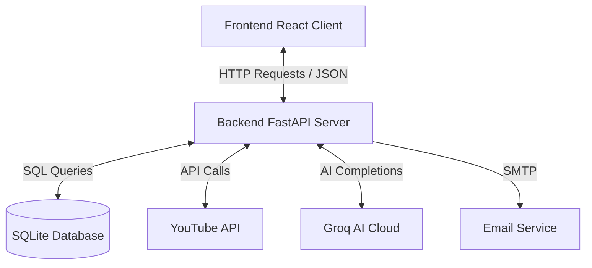

# 🏗️ Recap Architecture Guide

This guide explains how **Recap** (the YouTube AI Summarizer) is structured, how its parts communicate, and where to find key files in the codebase. It is written in simple language for developers of all experience levels.

---

## 🌟 High-Level Overview

Recap is a full-stack web application built using a **Decoupled Client-Server Architecture**. It consists of three primary components:



1. **Frontend (React Client):** A modern, responsive user interface that runs inside the user's browser.
2. **Backend (FastAPI Server):** A fast, asynchronous Python server that handles the business logic, fetches transcripts, talks to the AI, and coordinates database actions.
3. **Database (SQLite & SQLAlchemy):** A lightweight relational database that stores users, summaries, channel subscriptions, and intermediate state logs.

---

## 📂 Codebase Directory Layout

Here is where the key folders and files live:

```
YouTube_AI_Summarizer/
├── backend/                  # Python Backend Server
│   └── app/
│       ├── core/             # Configuration & Prompts
│       ├── routes/           # API Endpoints (Auth, Summaries, Channels)
│       ├── services/         # Business Logic (AI, YouTube, Email, Cache)
│       ├── database.py       # DB Session & Connection setup
│       ├── models.py         # SQLAlchemy Database Schemas
│       └── main.py           # FastAPI Application Entrypoint
├── frontend/                 # React Client App (Vite)
│   ├── src/
│   │   ├── components/       # Reusable UI Elements (Chat, Loader)
│   │   ├── pages/            # View Screens (Home, History, Dashboard)
│   │   ├── styles/           # CSS Styling (Styles, Dark/Light modes)
│   │   └── App.jsx           # App Routing and Layout config
│   └── package.json          # Frontend Dependencies & Run commands
├── docs/                     # Documentation and Guides
├── data/                     # Local Database & Cache Storage (SQLite)
├── start.bat                 # Bat script to launch both Frontend & Backend
└── README.md                 # Project introduction
```

---

## 🛠️ The Tech Stack

### 1. The Frontend (Client)
* **Vite + React:** For fast, modular component-based UI rendering.
* **Vanilla CSS:** Custom-crafted stylesheets with premium features like glassmorphic cards, smooth transitions, and a liquid light/dark theme toggle.
* **Google OAuth integration:** Enables secure Google login on the client.

### 2. The Backend (Server)
* **FastAPI:** A modern, high-performance Python web framework for building APIs.
* **SQLAlchemy:** An Object-Relational Mapper (ORM) used to write database queries in Python instead of raw SQL.
* **Uvicorn:** An ASGI server used to run the FastAPI backend locally.

### 3. Third-Party Integrations
* **Groq Cloud API:** Provides ultra-fast completions using open models (Llama 3.1 & 3.3).
* **YouTube Transcript API & Scraping:** Fetches transcripts and metadata directly from YouTube.
* **SMTP Server:** Connects to standard mail relays to deliver summaries directly to user email inboxes.

---

## 💾 Database Schema & Models

All database tables are defined in [models.py](file:///c:/Users/Asus/Desktop/YouTube_Video_%20Summarizer/backend/app/models.py). The tables include:

### 1. `users`
Stores user profile information returned from the Google Sign-in flow.
* Columns: `id` (Google Sub ID), `email`, `name`.

### 2. `summaries`
Stores completed video summaries generated by users.
* Columns: `id`, `user_id`, `video_id`, `title`, `summary_content` (JSON structure containing sections), `style` (bullet, student, etc.), `created_at`.

### 3. `channels`
Stores information about YouTube channels users have subscribed to for new upload notifications.
* Columns: `id` (YouTube Channel ID), `user_id`, `name`, `thumbnail_url`, `uploads_playlist_id`, `subscriber_count`, `video_count`, `subscribed_at`.

### 4. `channel_snapshots`
Stores historical snapshot data (subscriber and view counts) for subscribed channels to power analytics charts.
* Columns: `id`, `channel_id`, `subscribers`, `views`, `recorded_at`.

### 5. `partial_summaries`
Acts as a temporary database cache to store intermediate segment summaries during long-running summarization tasks. 
* Columns: `id`, `video_id`, `style`, `chunk_index`, `summary_text`, `created_at`.
* Features a unique constraint on `(video_id, style, chunk_index)` to prevent duplicate chunk logs.

---

## 🔒 Security & Environment Config

Sensitive keys (like `GROQ_API_KEY`, `GOOGLE_CLIENT_ID`, and email credentials) are never written in the code. Instead, they are placed in a `.env` file in the root folder, which is loaded on backend startup.

* `backend/app/core/config.py` (or environment variables) parses these variables to set up clients safely.
